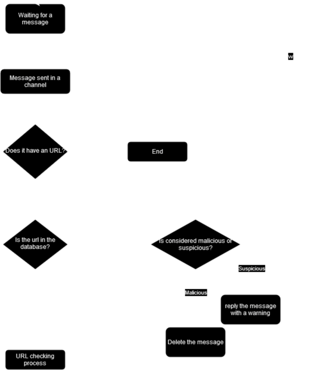

# OwlVigilance Work

The main functionality of the bot can be reduced to this diagram.

## Stored data

The data stored by the bot contains:

* URLs sent in messages
* Messages IDs
* Servers IDs

## How does the bot get the api keys?

Whenever you configure the API key for either VirusTotal, google safe search or urlScan, the bot stores the Message ID and the Server ID for being able to retrieve the api key when needed.

This way the only place where the API key is stored is in the Channel, and can be deleted anytime by the user without having to write any commands to the bot.

If you sent a new command to configure one of the api keys the message ID will be set up to the new one.

## Does it have any other function?

In order to get some small amount of revenue if the bot detects an amazon link it will remove the message and send exactly the same message but with an amazon tag.