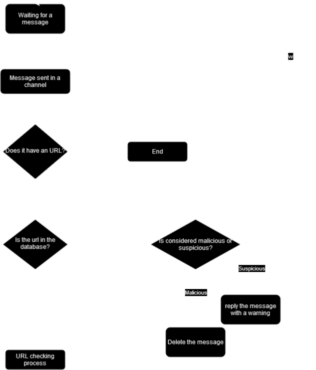

# OwlVigilance funcionamiento

La funcionalidad principal del bot puede reducirse a este diagrama

## Datos almacenados

Los datos que el bot almacena contienen:

* URLs mandadas en los mensajes
* IDs de los mensajes
* IDs de los servidores

## ¿Cómo gestiona el bot las api keys?

Cuando tu configuras una API key para cualquiera de los servicios, el bot almacena el ID del mensaje y el ID del servidor para poder recuperar la api key cuando sea necesaria.

De esta forma el unico sitio donde está almacenada la API key es en el canal, y puede ser borrada en cualquier momento por el usuario sin tener que mandar ningún comando al bot.

Si mandas de nuevo un comando para actualizar cualquiera de las APIs el bot actualizará automáticamente el ID del mensaje por el nuevo.

## ¿Tiene alguna otra función?

Para poder obtener algo de beneficio (para una bolsa de pipas al año aunque sea) si el bot detecta un enlace de amazon borrará el mensaje y mandará el mismo mensaje pero con un tag añadido a la url.