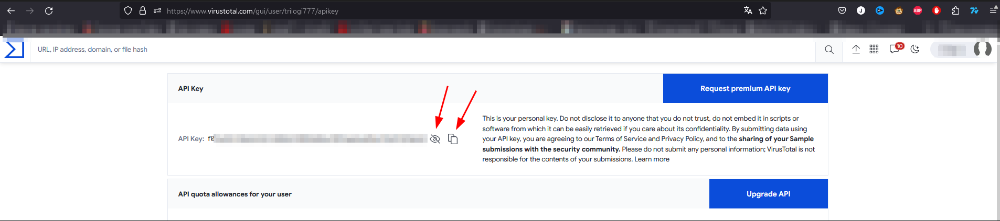
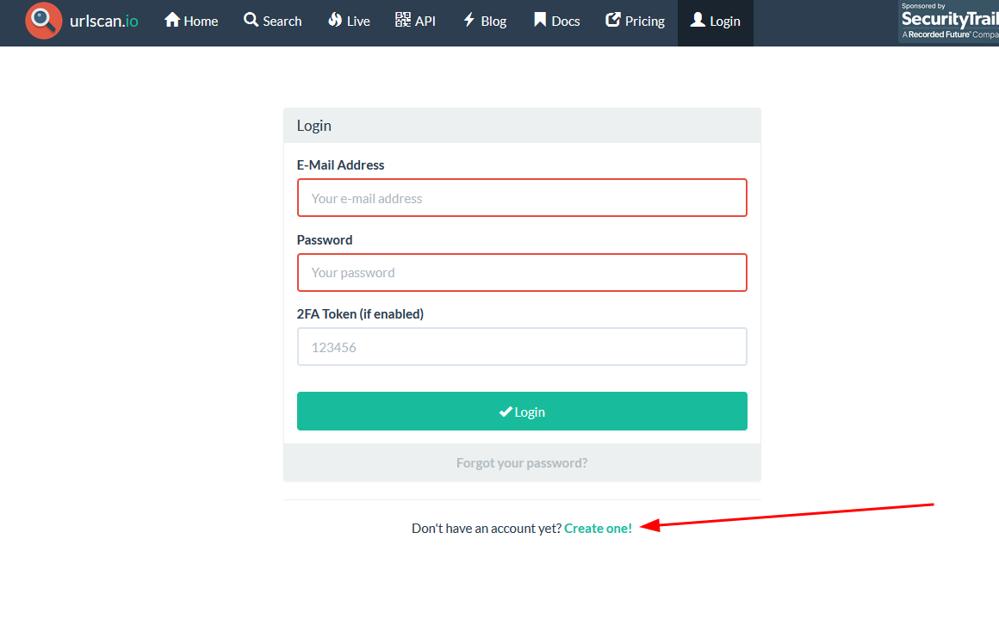
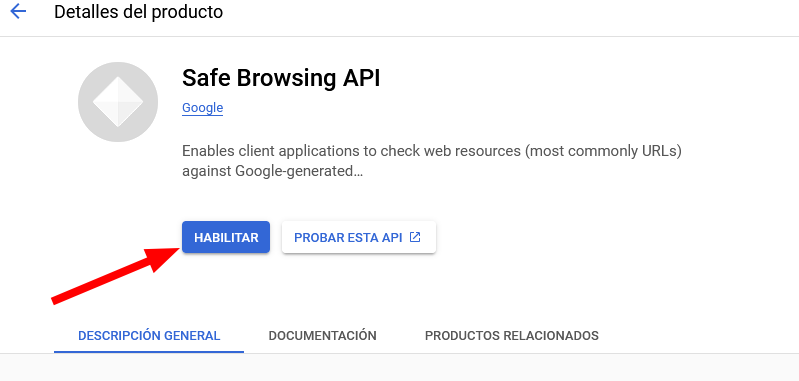

# OwlVigilance
Discord bot Para tu seguridad

*Nota: Este bot no es 100% fiable, incluso si el bot no lo detecta como malicioso nunca debes confiar en una URL que no conoces*

**Versión actual: 0.02 (beta)**
## Version updates:
**version: 0.02**
* Pequeña mejora en la detección de enlaces de amazon
* Añadidos multiprocesos en las peticiones a las APIs

**version: 0.01**
*Bot publicado

## Objetivo
El objetivo de este bot es acercar la ciberseguridad al público y hacer más seguro para todo el mundo estar en un chat público de discord.

## Funcionalidad

Este bot lee cualquier mensaje enviado en un canal al que tenga acceso, comprueba si contiene alguna URL en el, y si la encuentra comprueba con diversas plataformas si es maliciosa.

Dependiendo del resultado puede borrar el mensaje o responder a él avisando.

Puedes ahondar más sobre el proceso en [DeeperInfo](DeeperInfo.md#owlvigilance-work)

# Configuración

## Permisos solicitados

Los permisos necesarios para que el bot pueda funcionar son:

* Leer Mensajes / Ver Canales
* Mandar Mensajes
* Moderar MEnsajes 

## Instalación Básica

Primero necesitas añadir el bot a tu servidor:
[Link to add the bot](https://discord.com/api/oauth2/authorize?client_id=1156270414960541758&permissions=11264&redirect_uri=https%3A%2F%2Fgithub.com%2Ftrilogi77%2FOwlVigilance&scope=bot)

En este momento el bot funcionaría pero tendría unas capacidades muy limitadas

### Nuevos Canales

Tienes que configurar dos nuevos canales privados en tu servidor:
* owlsetup
* owllogs

El primero es obligatorio para tener el bot completamente funcional, el segundo solo se necesita para tener información de lo que hace el bot.

Asegurate de que el canal owlsetup solo es accesible por el bot , por ti y personas de absoluta confianza (preferiblemente solo tu y el bot)

### API keys

Para que el bot tenga una funcionalidad completa tendrás que configurar el bot proporcionandole las API kays de Virus Total, URLscan.io y googleSafeSearch. (El bot no guardara las credenciales, puedes comprobar como funciona en [DeeperInfo](DeeperInfo.md#how-does-the-bot-get-the-api-keys))

Los próximos pasos son como obtener las API keys

#### Virus total

Primero necesitas ir a  [virus total](https://www.virustotal.com/) y crearte una cuenta

puedes usar tu cuenta de google para crearla

Despues de registrarte tendrás un icono arriba a la derecha con tu nombre, haz click  y luego haz click en "API key"

Ahora ya tendrás la api key, no compartas esta clave con nadie, es personal para hacer login en los servicios de virus total

Ahora que ya tienes la API key de virus total puedes ir al canal **owlsetup** y escribir "!VT <API_KEY>" donde <API_KEY> debe ser sustituido por la API key que virus total te ha proporcionado.

Ya tenemos configurado Virus total!!!

#### URLscan.io

Necesitas ir a [UrlScan](https://urlscan.io/) y crearte una cuenta

-

Una vez registrado puedes ir a tu perfil y crear una api key.

Entonces copias la api key y vas de nuevo al canal
 **owlsetup** y escribes "!UrlScan <API_KEY>" donde <API_KEY> debe ser sustituido por la API key que urlScan te ha proporcionado.

#### Google Safe Search

1. Ve a [Google Developer Console](https://console.developers.google.com/)
2. Logueate con tu cuenta de google
3. Crea un nuevo proyecto
   
   

   
4. Pon el nombre al proyecto (No es relevante, pon el que quieras) apulsa crear
   
   
5. Ahora ve a la biblioteca
   
   
6. Busca "Safe browsing api" y selecciona la que no es legacy
   
   
7. Pulsa habilitar
   
   
8. Ahora ve a credenciales
   
   
9.  Crear credenciales --> API key
    
    
10. Ya tienes la api key que necesitamos.
    
    

11. copia la api key y ve de nuevo al canal **owlsetup** escribe "!Google  <API_KEY>" donde <API_KEY> debe ser sustituido por la API key que google te ha proporcionado.
   

**YA ESTÁ EL BOT CONFIGURADO!! :D**