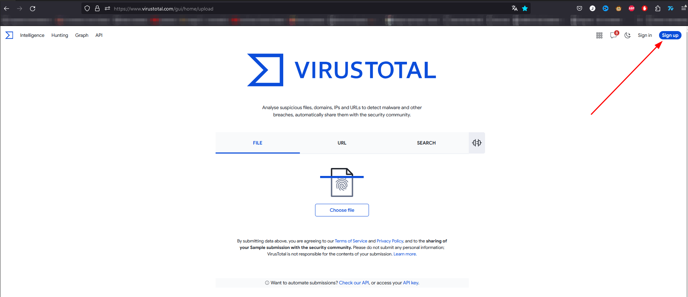
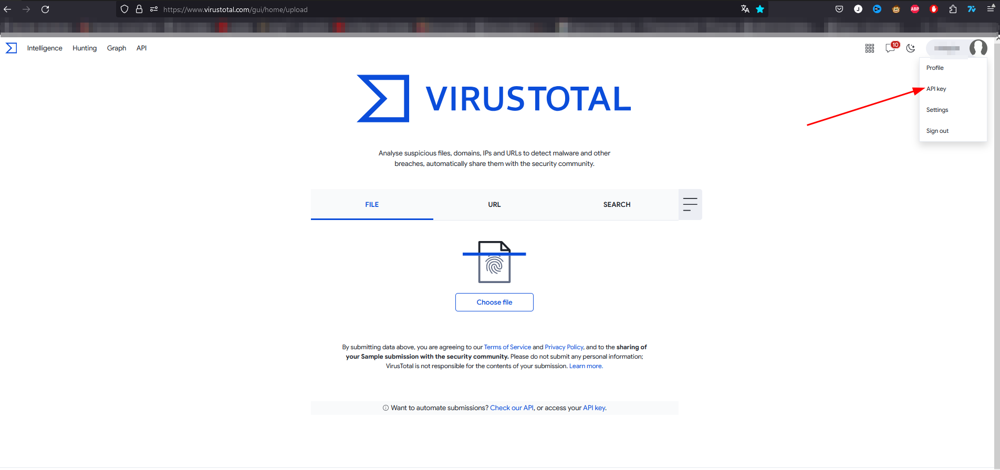
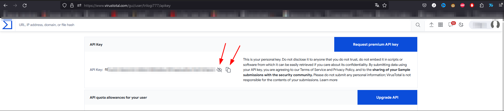
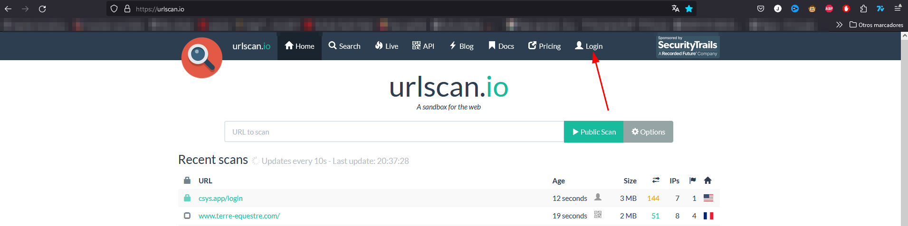
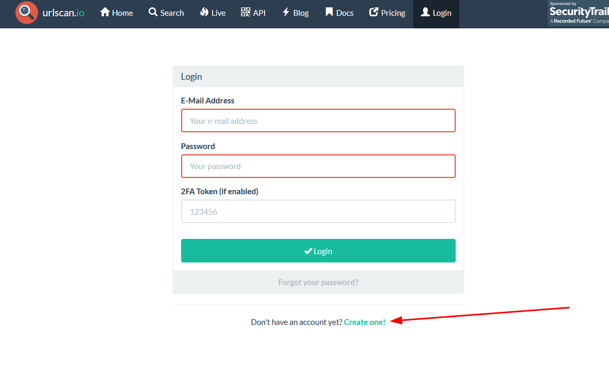
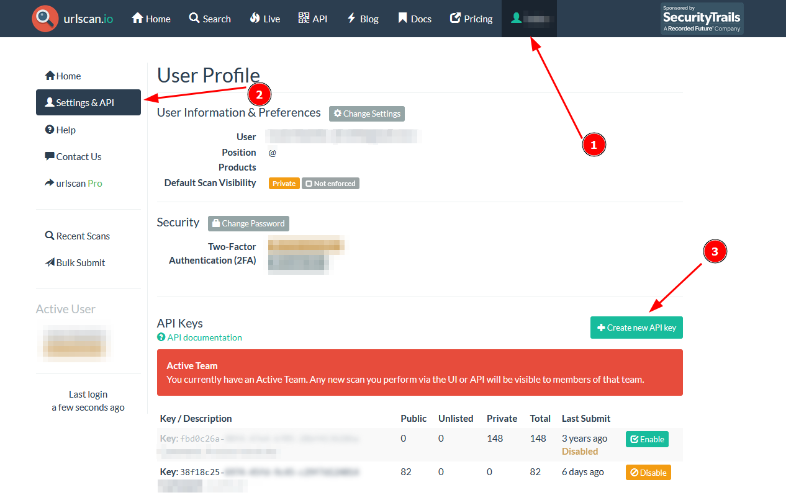

# OwlVigilance
Discord bot For your security

## Objective
The objective of this bot is to get cybersecurity closer to the public and make safer for everyone to be in public discord chats.

# Configuration

## Permisions requested

The permisions needed for the bot being able to work are:

* Read Messages / view channels
* Send Messages
* Manage Messages 

## Basic instalation

First you'll need to add the bot to your server:
[Link to add the bot](https://discord.com/api/oauth2/authorize?client_id=1156270414960541758&permissions=11264&redirect_uri=https%3A%2F%2Fgithub.com%2Ftrilogi77%2FOwlVigilance&scope=bot)

At this momment the bot will work but will be really limited.

### New channels

You should create 2 new text channels in your server:
* OwlSetup
* OwlLogs

The first one is compulsory for having the bot with complete functionality, the second one is only needed for having the information of the executions from the bot.

Make sure that the channel OwlSetup is only accesible by the bot, by you and only by really trusted persons (preferably only you)

### API keys

For having complete functionality you'll need to configure the bot providing it the api keys for Virus total, URLscan.io and googlesafesearch. (The bot won't store this credentials in the server, you can check how that works in [Link])

The next steps are how to get the api keys

#### Virus total

First you'll need to go to [virus total](https://www.virustotal.com/) and create an account

You can use your google account to create it

After registering you will have a icon in the top right side with your name, click it and click "API key"

Now you'll have an api key, do not share this key with anyone it's your personal login to the virustotal service.

Now that you have the API key from virus total you can go to the channel **OwlSetup** and write "!VT <API_KEY>" where <API_KEY> should be substituted by the API key that virus total provided you.

We have Setted up Virus total!!!

#### URLscan.io

You'll need to go to [UrlScan](https://urlscan.io/) and create an account

-

Once you are registered you can go to your profile and create an api key

Then you copy the api key and go again to the channel **OwlSetup** and write "!UrlScan <API_KEY>" where <API_KEY> should be substituted by the API key that virus total provided you.

